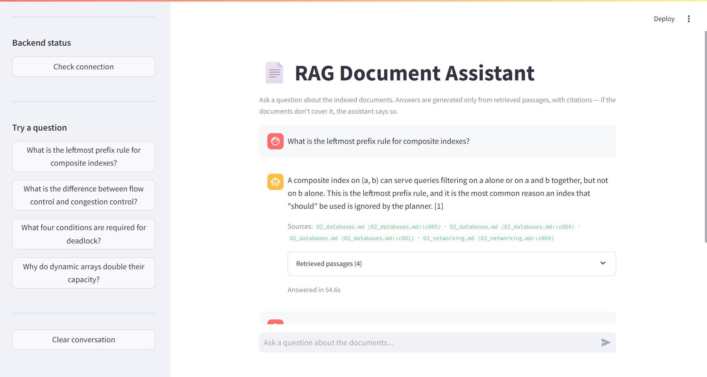
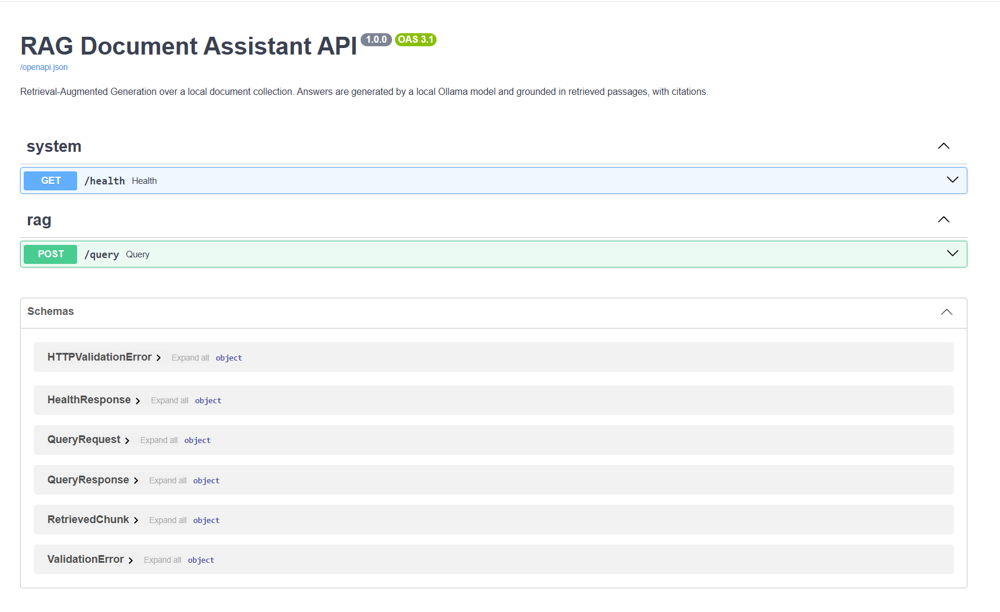

# RAG-Powered Document Assistant

A Retrieval-Augmented Generation web application that answers questions about a
local document collection. Answers are generated by a **local LLM via Ollama**
and grounded in retrieved passages, with inline citations — and when the
documents don't cover a question, the assistant says so instead of guessing.

**Track:** Core (text-only RAG)
**Domain:** Undergraduate computer-science study notes — data structures,
databases, networking, machine learning, operating systems.

---

## Table of contents

- [Architecture](#architecture)
- [Tech stack](#tech-stack)
- [Project structure](#project-structure)
- [Domain & data](#domain--data)
- [Quickstart](#quickstart)
- [Environment variables](#environment-variables)
- [API reference](#api-reference)
- [Testing](#testing)
- [Evaluation results](#evaluation-results)
- [Design decisions](#design-decisions)
- [Troubleshooting](#troubleshooting)

---

## Architecture

```
                    ┌──────────────────────────────────────────┐
  BUILD TIME        │  notebooks/rag_pipeline.ipynb            │
  (run once)        │  (or scripts/build_index.py)             │
                    │                                          │
   data/raw/  ──────▶  load → clean → chunk → embed            │
   .pdf .md .txt    │                        │                 │
                    └────────────────────────┼─────────────────┘
                                             ▼
                              backend/data/vector_store/
                              (Chroma, persisted to disk)
                                             │
  ═════════════════════════════════════════  │  ═══════════════════════
                                             │
  REQUEST TIME                    loaded once at startup
                                             │
  ┌──────────────┐   POST /query   ┌─────────▼──────────────────────┐
  │  Streamlit   │ ──────────────▶ │  FastAPI backend               │
  │  frontend    │                 │                                │
  │  :8501       │ ◀────────────── │  1. embed question             │
  └──────────────┘  answer +       │  2. search top-k chunks        │
                    sources +      │  3. drop hits below score floor│
                    passages       │  4. no hits? → refuse, no LLM  │
                                   │  5. build grounded prompt      │
                                   │  6. call Ollama ───────────────┼──▶ Ollama
                                   │  7. return answer + citations  │    :11434
                                   └────────────────────────────────┘
```

The important property: **the vector store and embedding model are loaded once
at startup**, not per request. The only thing embedded at request time is the
user's question.

---

## Tech stack

| Layer | Choice | Why |
|---|---|---|
| Embeddings | `sentence-transformers/all-MiniLM-L6-v2` (384-d) | Fast on CPU, ~80 MB, coexists with a local LLM on a student laptop |
| Vector DB | ChromaDB (`PersistentClient`, cosine) | Zero setup, persists to disk, loads directly in the backend |
| LLM | Ollama — `llama3.2:3b` | Local, free, no API key; temperature 0.1 for faithful extraction |
| Backend | FastAPI + Pydantic v2 | Automatic validation (422s for free) and OpenAPI docs |
| Frontend | Streamlit | Chat UI in a small amount of code |
| Tests | pytest + `TestClient` | Services faked, so the suite runs without Ollama |

---

## Project structure

```
rag-assistant-project/
├── rag_core/                   # shared library — used by notebook, scripts AND backend
│   ├── loader.py               # PDF/MD/TXT loading, cleaning, OCR detection
│   ├── chunking.py             # heading-aware chunking with overlap
│   ├── indexer.py              # embeddings + persisted Chroma store
│   ├── prompts.py              # grounded prompt template, citations, score floor
│   └── evaluation.py           # test question set + scoring
├── data/raw/                   # source documents (drop your PDFs here)
├── notebooks/
│   └── rag_pipeline.ipynb      # the build & evaluation report (sections 2.1–2.7)
├── scripts/
│   ├── build_index.py          # rebuild the vector store from the CLI
│   ├── run_evaluation.py       # run the eval set, write docs/evaluation_results.md
│   └── verify_submission.py    # pre-submission self-check
├── backend/
│   ├── app/
│   │   ├── main.py             # FastAPI app, CORS, lifespan startup loading
│   │   ├── api/routes/query.py # GET /health, POST /query
│   │   ├── core/config.py      # settings from .env
│   │   ├── schemas/query.py    # QueryRequest / QueryResponse
│   │   ├── services/
│   │   │   ├── retrieval.py    # loads vector store, retrieves chunks
│   │   │   └── generation.py   # calls Ollama, builds the answer
│   │   └── utils/logging_config.py
│   ├── data/vector_store/      # produced by the notebook — not committed
│   ├── tests/test_query.py
│   ├── requirements.txt
│   ├── .env.example
│   └── Dockerfile
├── frontend/
│   ├── app.py                  # Streamlit chat interface
│   ├── api_client.py           # backend API wrapper
│   ├── .env.example
│   └── requirements.txt
├── docs/
│   ├── evaluation_results.md   # generated by the notebook / eval script
│   └── demo_guide.md           # prep notes for the live demo
└── README.md
```

`rag_core/` exists so the chunking and prompting logic has exactly one
definition. Duplicating it between the notebook and the backend would let the
two drift apart, and a backend that chunks differently from the index it queries
is a very hard bug to spot.

---

## Domain & data

Five Markdown documents (~22,000 characters, 35 chunks) of undergraduate CS study
notes, committed under `data/raw/`.

The corpus was chosen because it is dense with precise, checkable facts — numeric
thresholds (hash-table load factor 0.75), named algorithms, and deliberately
confusable concept pairs (flow control vs congestion control, non-repeatable vs
phantom reads). That makes hallucination easy to *detect* during evaluation,
which a vaguer corpus would hide.

**To use your own documents:** drop `.pdf`, `.md` or `.txt` files into
`data/raw/`, re-run `python scripts/build_index.py`, and update the question set
in `rag_core/evaluation.py`. No other code changes are needed — the loader
handles PDF text extraction, hyphenation repair and scanned-PDF detection.

---

## Quickstart

### Prerequisites

| Tool | Minimum | Check |
|---|---|---|
| Python | 3.10 | `python --version` |
| Ollama | latest | `ollama --version` |
| Git | any recent | `git --version` |

### 1. Clone and create a virtual environment

```bash
git clone https://github.com/fatmabadawy/rag-assistant-app.git
cd rag-assistant-app

python -m venv .venv
.venv\Scripts\activate          # Windows
# source .venv/bin/activate     # macOS / Linux
```

### 2. Start Ollama and pull a model

```bash
ollama serve                    # leave running in its own terminal
ollama pull llama3.2:3b         # ~2 GB. Use llama3.2:1b on a slower machine.
ollama list                     # confirm the model is there
```

### 3. Build the vector store

```bash
pip install -r backend/requirements.txt
python scripts/build_index.py
```

Takes roughly 30 seconds; the first run also downloads the ~80 MB embedding
model. You should see `35 chunks` written to `backend/data/vector_store/`.

> The vector store is **not committed** (it is in `.gitignore`), so this step is
> required on a fresh clone. Alternatively, run
> `notebooks/rag_pipeline.ipynb` top-to-bottom — it produces the same store and
> is the full report.

### 4. Start the backend — terminal 1

```bash
cd backend
cp .env.example .env            # copy .env.example .env   on Windows
uvicorn app.main:app --reload
```

Confirm it is healthy: open <http://localhost:8000/docs>, or

```bash
curl http://localhost:8000/health
```

Both `vector_store_loaded` and `llm_reachable` should be `true`.

### 5. Start the frontend — terminal 2

```bash
cd frontend
pip install -r requirements.txt
cp .env.example .env            # copy .env.example .env   on Windows
streamlit run app.py
```

Open <http://localhost:8501> and ask a question.

---

## Environment variables

### `backend/.env`

| Variable | Default | Description |
|---|---|---|
| `VECTOR_STORE_DIR` | `./data/vector_store` | Chroma store produced by the notebook |
| `EMBEDDING_MODEL` | `sentence-transformers/all-MiniLM-L6-v2` | Must match the model the store was built with — startup asserts this |
| `TOP_K` | `4` | Passages retrieved per question |
| `MIN_SCORE` | `0.25` | Cosine-similarity floor; below it the API refuses without calling the LLM |
| `OLLAMA_HOST` | `http://localhost:11434` | Ollama server address |
| `OLLAMA_MODEL` | `llama3.2:3b` | Generation model |
| `OLLAMA_TIMEOUT` | `120` | Seconds before giving up on the LLM |
| `TEMPERATURE` | `0.1` | Low, to favour faithful extraction over fluency |
| `LOG_LEVEL` | `INFO` | Python logging level |
| `CORS_ORIGINS` | `http://localhost:8501,http://127.0.0.1:8501` | Comma-separated allowed origins |

### `frontend/.env`

| Variable | Default | Description |
|---|---|---|
| `API_BASE_URL` | `http://localhost:8000` | Backend base URL. Read from the environment — never hard-coded in `app.py` |

---

## API reference

Interactive docs: <http://localhost:8000/docs>

### `GET /health`

```bash
curl http://localhost:8000/health
```

```json
{
  "status": "ok",
  "version": "1.0.0",
  "vector_store_loaded": true,
  "n_chunks": 35,
  "embedding_model": "sentence-transformers/all-MiniLM-L6-v2",
  "llm_model": "llama3.2:3b",
  "llm_reachable": true
}
```

### `POST /query`

```bash
curl -X POST http://localhost:8000/query \
  -H "Content-Type: application/json" \
  -d '{"question": "What is the leftmost prefix rule for composite indexes?"}'
```

**Request**

| Field | Type | Required | Notes |
|---|---|---|---|
| `question` | string | yes | 3–1000 characters |
| `top_k` | integer | no | 1–10; overrides the configured default |

**Response**

```json
{
  "answer": "A composite index on (a, b) can serve queries filtering on a alone, or on a and b together, but not on b alone [1].",
  "sources": ["02_databases.md (02_databases.md::c005)"],
  "chunks": [
    {
      "chunk_id": "02_databases.md::c005",
      "source": "02_databases.md",
      "score": 0.7412,
      "preview": "[Database Systems — Study Notes > Indexing] A composite index on (a, b)..."
    }
  ],
  "grounded": true,
  "latency_ms": 2841
}
```

**Status codes**

| Code | Meaning |
|---|---|
| `200` | Success. `grounded: false` means nothing cleared the score floor and the assistant declined to answer |
| `422` | Validation error — missing, too short, or out-of-range field |
| `503` | Vector store not loaded, or Ollama unreachable |

---

## Testing

```bash
cd backend
python -m pytest -v
```

Eight tests, running in well under a second. They cover the happy path
(grounded answer with a citation and sources), three validation cases returning
`422`, the refusal path when nothing clears the score floor, and `503` handling
for a missing vector store and an unreachable LLM.

Retrieval and generation are replaced with in-memory fakes, so **the suite needs
neither Ollama nor a built index**. It tests the API contract, not model quality
— model quality is what the evaluation in the notebook measures.

---

## Evaluation results

Generated by `notebooks/rag_pipeline.ipynb` §2.6, or:

```bash
python scripts/run_evaluation.py                  # full, needs Ollama
python scripts/run_evaluation.py --retrieval-only # retrieval only, no LLM needed
```

Results are written to [`docs/evaluation_results.md`](docs/evaluation_results.md).

The set contains 14 questions: 12 answerable from the corpus, and **2
deliberately out-of-domain** (a stock price, a coding request) whose correct
behaviour is a refusal. Retrieval and answer grounding are scored separately,
because they fail for different reasons and a single combined number hides which
one broke.

> Run the evaluation on your own machine and paste the resulting table here
> before submitting — the numbers depend on your Ollama model and hardware.

---

## Pre-submission check

```bash
python scripts/verify_submission.py              # full check
python scripts/verify_submission.py --skip-live  # skip backend/Ollama checks
```

Checks the deliverables list, every "common mistake that loses points" from the
brief (committed `.env`, committed vector store, hard-coded `localhost:8000`,
notebook sections 2.1–2.7 present and parsing), that pytest passes, that the
evaluation has actually been generated rather than left as a placeholder, and
that no forbidden file is tracked by git. Exits non-zero if anything must be
fixed.

---

## Publishing to GitHub

```bash
# from the repository root, with .gitignore already in place
git init
git add .
git status                  # read this list — no .venv, no .env, no vector_store
git commit -m "RAG assistant: notebook, FastAPI backend, frontend"

# create a PUBLIC repository on github.com named rag-assistant-app, then:
git remote add origin https://github.com/fatmabadawy/rag-assistant-app.git
git branch -M main
git push -u origin main
```

**Verify like a stranger** — this is an explicit grading criterion:

```bash
cd /tmp
git clone https://github.com/fatmabadawy/rag-assistant-app.git fresh-check
cd fresh-check
python -m venv .venv && source .venv/bin/activate
# now follow ONLY your README, top to bottom
python scripts/verify_submission.py
```

If any step fails, fix the README rather than working around it.

---

## Design decisions

**Chunking: heading-aware, 900 characters, 150 overlap.** 900 stays under
`all-MiniLM-L6-v2`'s 256-token truncation limit (~1000–1100 characters). Text past
that limit is silently ignored during embedding with no error anywhere, which
degrades retrieval invisibly. Markdown headings are tracked rather than treated
as body text, and each chunk is prefixed with its heading path
(`[Operating Systems > Synchronisation]`) so a passage saying *"it requires four
conditions"* still embeds near the word *"deadlock"*.

**A relevance floor, not just top-k.** Plain top-k always returns *k* chunks, even
for a question the corpus cannot answer — and a fluent LLM will happily write a
confident answer around chunks scoring 0.1. Dropping hits below 0.25 and refusing
outright when none survive is the single highest-impact grounding measure here,
and it also means off-topic questions never pay the LLM's latency cost.

**Citations as an observability tool.** Numbered `[n]` markers are not decoration:
they make an ungrounded claim visible to the reader, and they let
`score_answer()` automatically fail an uncited answer during evaluation rather
than someone noticing it mid-demo.

**Startup loading via FastAPI lifespan.** Loading a sentence-transformer takes
1–3 seconds. Doing it per request would dominate latency. The embedding model is
also warmed with a dummy encode at startup so the first real question is not
artificially slow.

**A missing vector store degrades rather than crashes.** If the store cannot be
loaded, the app still starts and `/health` reports exactly what is wrong. A
process that refuses to boot tells the operator nothing.

---

## Troubleshooting

| Symptom | Cause and fix |
|---|---|
| `/health` shows `vector_store_loaded: false` | Run `python scripts/build_index.py` from the repo root |
| `/health` shows `llm_reachable: false` | Ollama isn't running. `ollama serve`, then `ollama pull llama3.2:3b` |
| `embedding model mismatch` on startup | The store was built with a different model. Rebuild the index, or fix `EMBEDDING_MODEL` in `backend/.env` |
| Frontend: *Cannot reach the backend* | Backend isn't running, or `API_BASE_URL` is wrong in `frontend/.env` |
| Browser console CORS error | Add the frontend origin to `CORS_ORIGINS` in `backend/.env` |
| Answers take 30s+ | A 3B model on CPU is slow. Try `ollama pull llama3.2:1b` and set `OLLAMA_MODEL=llama3.2:1b` |
| Assistant refuses questions it should answer | `MIN_SCORE` is too high, or the topic isn't in the corpus. Check `/query`'s `chunks` array for the actual scores |
| Assistant answers things it shouldn't | Raise `MIN_SCORE` in `backend/.env` |
| `ModuleNotFoundError: rag_core` | Run from the repository root, or start uvicorn from `backend/` — `main.py` adds the repo root to `sys.path` |

---

## Screenshots



